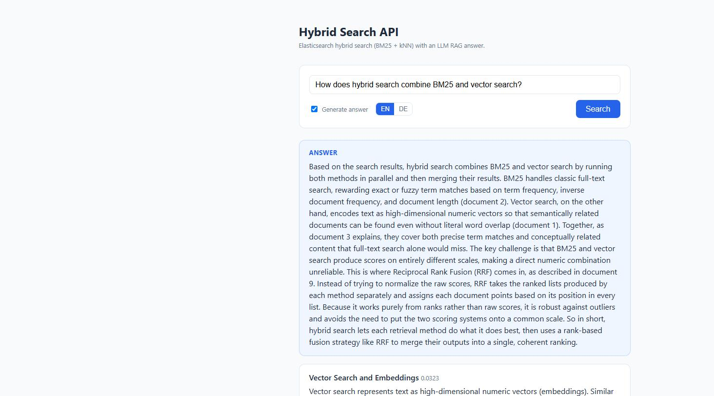
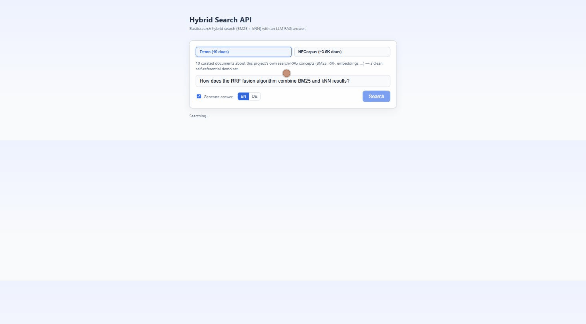
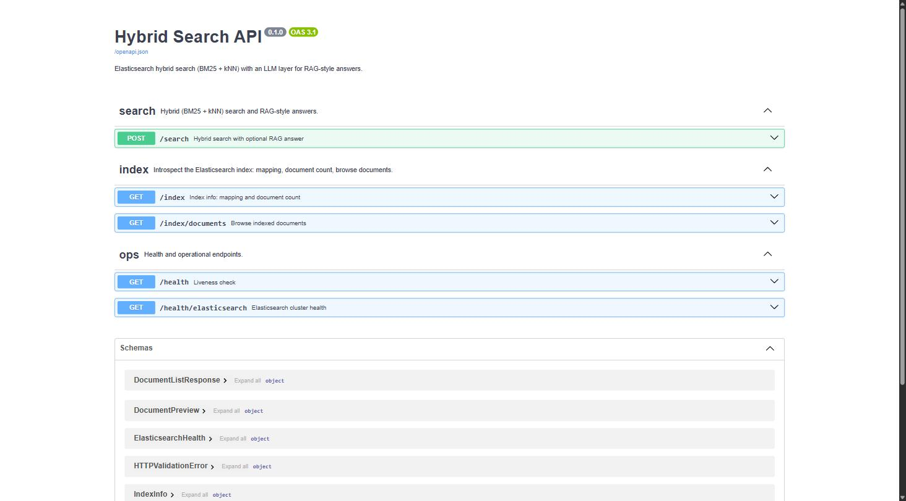

# Hybrid Search API


**Sprache:** [English](README.md) | **Deutsch**

Elasticsearch-Suche (klassisches BM25 **und** Vektor-/kNN-Suche, fusioniert per
Reciprocal Rank Fusion) kombiniert mit einer LLM-Schicht (jeder OpenAI-kompatible
Endpunkt - z. B. ein Firmen-Gateway vor Claude, oder OpenAI direkt), die aus
den Top-Treffern eine kurze, quellenbasierte Antwort formuliert (RAG-Pattern).





## Beispiel (echter Output)

Anfrage:

```bash
curl -X POST http://localhost:8000/search \
  -H "Content-Type: application/json" \
  -d '{"query": "Wie funktioniert Vektorsuche?", "top_k": 3, "lang": "de"}'
```

`answer`-Feld der Antwort:

> Zur Vektorsuche liefern die Suchergebnisse nur begrenzte, aber relevante
> Informationen. Grundlage der Vektorsuche sind sogenannte
> Embedding-Vektoren. Laut Dokument "Sentence Transformer Models" wandeln
> Modelle wie all-MiniLM-L6-v2 ganze Saetze in solche Vektoren um, anstatt
> einzelne Woerter isoliert zu betrachten. Dadurch koennen Kontext und
> Bedeutung besser erfasst werden als mit klassischen Wort-Embeddings. Die
> eigentliche Suche funktioniert dann so, dass Suchanfragen ebenfalls in
> einen Vektor umgewandelt und mit den gespeicherten Vektoren verglichen
> werden, um semantisch aehnliche Inhalte zu finden. Wie genau dieser
> Vergleich technisch ablaeuft, etwa durch Aehnlichkeitsmasse wie
> Kosinus-Aehnlichkeit, geht aus den vorliegenden Suchergebnissen jedoch
> nicht hervor. Darueber hinaus enthalten die anderen Dokumente keine
> weiteren Informationen zur Vektorsuche.

Bemerkenswert: Das Modell benennt explizit, was die Quellen *nicht*
hergeben (die technische Funktionsweise des Vektorvergleichs), statt sich
etwas auszudenken - genau das Grounding-Verhalten, das ein RAG-System
liefern soll, nicht nur behauptet.

Interaktive API-Dokumentation ist ebenfalls per Swagger verfuegbar:



## Kosten pro RAG-Antwort

Ueber 10 unterschiedliche, inhaltlich passende Testanfragen (eine pro
Beispieldokument) ergab sich im Schnitt folgender Tokenverbrauch fuer den
LLM-Antwortschritt (`use_llm_answer=true`):

| Metrik | Durchschnitt |
|---|---|
| Prompt-Tokens (Suchkontext + Frage) | ~417 |
| Completion-Tokens (generierte Antwort) | ~343 |
| Gesamt | ~760 |

Bewusst in Tokens statt in Euro/Dollar angegeben: Der tatsaechliche
Geldbetrag haengt vom gewaehlten LLM-Provider und dessen Preisliste ab -
die Tokenzahl bleibt davon unabhaengig und laesst sich mit dem Preis pro
Token des jeweils eingesetzten Modells direkt umrechnen.

## Warum dieses Projekt

Zeigt in einem zusammenhaengenden Projekt drei Kernkompetenzen:
- **Backend-Engineering** - sauber strukturierte FastAPI-Anwendung, getestet, containerisiert, CI.
- **Such-Spezialisierung** - Elasticsearch-Mapping, custom Analyzer (Stemming, Stoppwoerter), BM25, kNN-Vektorsuche, Ranking-Fusion.
- **KI-Integration** - produktionsnahe LLM-Anbindung (Retry-Logik, Streaming, versionierte Prompts, RAG).

## Architektur

Siehe [docs/architecture.de.md](docs/architecture.de.md).

## Setup

```bash
git clone https://github.com/Sheodred/hybrid-search-api.git
cd hybrid-search-api
cp .env.example .env  # LLM_API_KEY (+ ggf. LLM_BASE_URL) eintragen

docker compose up -d  # startet Elasticsearch + API

pip install -e ".[dev]"
python scripts/seed_data.py  # Beispieldaten indexieren - laedt beim allerersten
                              # Lauf einmalig das Embedding-Modell (~80MB)
```

Fuer die LLM-Anbindung funktioniert jeder OpenAI-kompatible Endpunkt, auch ein
lokales Modell via [Ollama](https://ollama.com) - ganz ohne Cloud-Key. Dazu
`LLM_BASE_URL` statt auf ein Cloud-Gateway auf Ollamas OpenAI-kompatiblen
Endpunkt zeigen lassen (siehe der auskommentierte Block in `.env.example`):

```bash
LLM_API_KEY=ollama       # Ollama ignoriert den Wert, er darf nur nicht leer sein
LLM_BASE_URL=http://localhost:11434/v1
LLM_MODEL=llama3.1
```

### Test mit einem groesseren, fachfremden Korpus

Die 10 Beispieldokumente in `seed_data.py` handeln bewusst von Such-/RAG-Konzepten
selbst - gut fuer eine saubere Demo, zeigt aber nichts ueber Skalierung.
Dafuer laedt `scripts/seed_nfcorpus.py`
[NFCorpus](https://github.com/beir-cellar/beir) (~3.600 medizinische
Dokumente, ein anerkannter IR-Benchmark) in einen eigenen Index, ohne den
Standard-Index anzuruehren:

```bash
python scripts/seed_nfcorpus.py            # indexiert in '<ELASTICSEARCH_INDEX>_nfcorpus'
ELASTICSEARCH_INDEX=documents_nfcorpus docker compose up -d --build api
```

## Nutzung

`POST /search` mit `{"query": "...", "top_k": 5, "use_llm_answer": true, "lang": "de"}` -
`lang` ist `"en"` (Standard) oder `"de"` und steuert die Sprache der RAG-Antwort
sowie der Fehlermeldungen. Ein echtes Beispiel inkl. Antwort steht oben unter
"Beispiel (echter Output)".

Interaktive API-Doku (Swagger): http://localhost:8000/docs

## Tests

```bash
pytest -v
ruff check .
```

## Tech-Stack

Python 3.11+ - FastAPI - Elasticsearch - OpenAI-kompatible LLM-Anbindung - Docker - pytest - ruff - GitHub Actions

## Roadmap

- [x] Echtes Embedding-Modell fuer die Vektorsuche (sentence-transformers, all-MiniLM-L6-v2, lokal)
- [ ] Reranking der Top-Treffer mit einem Cross-Encoder
- [ ] Query-Caching
- [ ] Auth (API-Key) fuer den `/search`-Endpunkt

## Lizenz

MIT - siehe [LICENSE](LICENSE)
