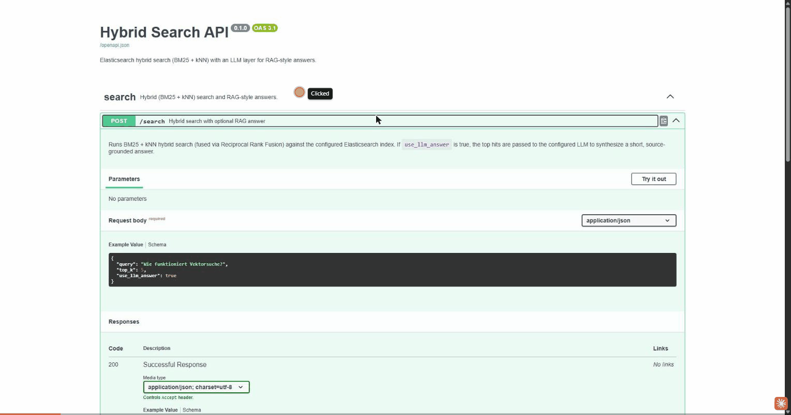

# Hybrid Search API


Elasticsearch-Suche (klassisches BM25 **und** Vektor-/kNN-Suche, fusioniert per
Reciprocal Rank Fusion) kombiniert mit einer LLM-Schicht (jeder OpenAI-kompatible
Endpunkt - z. B. ein Firmen-Gateway vor Claude, oder OpenAI direkt), die aus
den Top-Treffern eine kurze, quellenbasierte Antwort formuliert (RAG-Pattern).




## Beispiel (echter Output)

Anfrage:

```bash
curl -X POST http://localhost:8000/search \
  -H "Content-Type: application/json" \
  -d '{"query": "Wie funktioniert Vektorsuche?", "top_k": 3}'
```

`answer`-Feld der Antwort:

> ## Vektorsuche
>
> Laut **Dokument [1]** funktioniert Vektorsuche folgendermassen:
>
> - Dokumente werden als **Embedding-Vektoren** repraesentiert
> - Die Suche verwendet **kNN (k-Nearest-Neighbor)**, um aehnliche Dokumente zu finden
> - Im Gegensatz zur klassischen Suche wird **keine exakte Wortuebereinstimmung**
>   benoetigt - stattdessen wird **semantische Aehnlichkeit** gemessen
>
> Die anderen Suchergebnisse [2] und [3] betreffen verwandte, aber andere Themen
> und liefern keine weiteren Details zur Vektorsuche selbst.

Bemerkenswert: Das Modell zitiert nur das tatsaechlich relevante Dokument und
markiert die anderen Treffer explizit als nicht einschlaegig, statt sie
unreflektiert zu vermischen - das ist das Grounding-Verhalten, das ein
RAG-System liefern soll, nicht nur behauptet.

## Kosten pro RAG-Antwort

Ueber 10 unterschiedliche, inhaltlich passende Testanfragen (eine pro
Beispieldokument) ergab sich im Schnitt folgender Tokenverbrauch fuer den
LLM-Antwortschritt (`use_llm_answer=true`):

| Metrik | Durchschnitt |
|---|---|
| Prompt-Tokens (Suchkontext + Frage) | ~417 |
| Completion-Tokens (generierte Antwort) | ~343 |
| Gesamt | ~760 |

Bewusst in Tokens statt in Euro/Dollar angegeben: Der tatsaechliche
Geldbetrag haengt vom gewaehlten LLM-Provider und dessen Preisliste ab -
die Tokenzahl bleibt davon unabhaengig und laesst sich mit dem Preis pro
Token des jeweils eingesetzten Modells direkt umrechnen.

## Warum dieses Projekt

Zeigt in einem zusammenhaengenden Projekt drei Kernkompetenzen:
- **Backend-Engineering** - sauber strukturierte FastAPI-Anwendung, getestet, containerisiert, CI.
- **Such-Spezialisierung** - Elasticsearch-Mapping, custom Analyzer (Stemming, Stoppwoerter), BM25, kNN-Vektorsuche, Ranking-Fusion.
- **KI-Integration** - produktionsnahe LLM-Anbindung (Retry-Logik, Streaming, versionierte Prompts, RAG).

## Architektur

Siehe [docs/architecture.md](docs/architecture.md).

## Setup

```bash
git clone https://github.com/Sheodred/hybrid-search-api.git
cd hybrid-search-api
cp .env.example .env  # LLM_API_KEY (+ ggf. LLM_BASE_URL) eintragen

docker compose up -d  # startet Elasticsearch + API

pip install -e ".[dev]"
python scripts/seed_data.py  # Beispieldaten indexieren - laedt beim allerersten
                              # Lauf einmalig das Embedding-Modell (~80MB)
```

## Nutzung

`POST /search` mit `{"query": "...", "top_k": 5, "use_llm_answer": true}` -
ein echtes Beispiel inkl. Antwort steht oben unter "Beispiel (echter Output)".

Interaktive API-Doku (Swagger): http://localhost:8000/docs

## Tests

```bash
pytest -v
ruff check .
```

## Tech-Stack

Python 3.11+ - FastAPI - Elasticsearch - OpenAI-kompatible LLM-Anbindung - Docker - pytest - ruff - GitHub Actions

## Roadmap

- [x] Echtes Embedding-Modell fuer die Vektorsuche (sentence-transformers, all-MiniLM-L6-v2, lokal)
- [ ] Reranking der Top-Treffer mit einem Cross-Encoder
- [ ] Query-Caching
- [ ] Auth (API-Key) fuer den `/search`-Endpunkt

## Lizenz

MIT - siehe [LICENSE](LICENSE)
